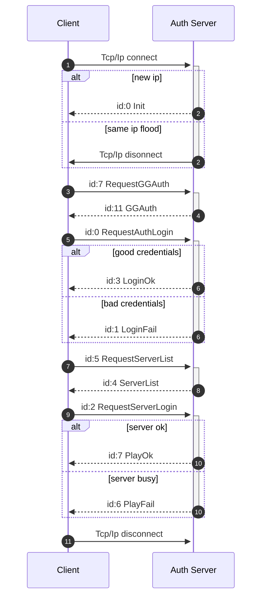

# Description of client-server protocol

Description client-server communication protocol based on [L2JLisvus](https://gitlab.com/TheDnR/l2j-lisvus/) server emulator.


# Authentification

Game servers have at least two differrent revisions of auth server protocol c621 and 785a. l2j-lisvus uses c621 which is described below.




     
    


## Auth server -> client packets


### 0. Packets common structure
Packets have similar structure to eachother. They consist of:
   

| Hex | Size | Description |
|-----|------|-------------|
|XX XX|2|Size of packet|
|XX XX XX XX .. |N|Body of packet|
|XX XX ? |?| Checksum (only auth server communications) |

There are 6 different types of data that can be passed in packet

| Hex | Size | Type description |
|-----|------|-------------|
|XX XX XX .. \0|N|string UTF8|
|XX XX XX XX ..|8|float|
|XX XX XX XX ..|8|int 64|
|XX XX XX XX|4|int 32|
|XX XX|2|int 16|
|XX|1|int 8|


Auth server packets are encrypted using [Blowfish](https://en.wikipedia.org/wiki/Blowfish_(cipher)) algorithm with 21 bytes hardcoded key:
```
5F 3B 35 2E 5D 39 34 2D 33 31 3D 3D 2D 25 78 54 21 5E 5B 24 # Actual key
00 # End of key indicator
```


### 1. [Init](https://gitlab.com/TheDnR/l2j-lisvus/-/blame/main/core/java/net/sf/l2j/loginserver/serverpackets/Init.java#L19)
----

| Hex | Size | Description |
|-----|------|-------------|
| 00 | 1 | [Type](https://gitlab.com/TheDnR/l2j-lisvus/-/blame/main/core/java/net/sf/l2j/loginserver/serverpackets/Init.java#L43) |
| XX XX XX XX |  4 | [Session ID](https://gitlab.com/TheDnR/l2j-lisvus/-/blame/main/core/java/net/sf/l2j/loginserver/serverpackets/Init.java#L44) |
| 21 C6 00 00| 4 | [Protocol revision](https://gitlab.com/TheDnR/l2j-lisvus/-/blame/main/core/java/net/sf/l2j/loginserver/serverpackets/Init.java#L45) |
| XX XX XX XX ... | 128| [RSA Public Key](https://gitlab.com/TheDnR/l2j-lisvus/-/blame/main/core/java/net/sf/l2j/loginserver/serverpackets/Init.java#L47)|
| 29 DD 95 4E | 4 | [GG related](https://gitlab.com/TheDnR/l2j-lisvus/-/blame/main/core/java/net/sf/l2j/loginserver/serverpackets/Init.java#L50) |     
| 77 C3 9C FC | 4 | [GG related](https://gitlab.com/TheDnR/l2j-lisvus/-/blame/main/core/java/net/sf/l2j/loginserver/serverpackets/Init.java#L51) |          
| 97 AD B6 20 | 4 | [GG related](https://gitlab.com/TheDnR/l2j-lisvus/-/blame/main/core/java/net/sf/l2j/loginserver/serverpackets/Init.java#L52) |     
| 07 BD E0 F7 | 4 | [GG related](https://gitlab.com/TheDnR/l2j-lisvus/-/blame/main/core/java/net/sf/l2j/loginserver/serverpackets/Init.java#L53) |
| XX XX XX XX ...| 20 | [Blowfish key (Only if compatibility mode enabled)](https://gitlab.com/TheDnR/l2j-lisvus/-/blame/main/core/java/net/sf/l2j/loginserver/serverpackets/Init.java#L57) |
| 00 | 1 | [End of key indicator (Only if compatibility mode enabled)](https://gitlab.com/TheDnR/l2j-lisvus/-/blame/main/core/java/net/sf/l2j/loginserver/serverpackets/Init.java#L58) |
