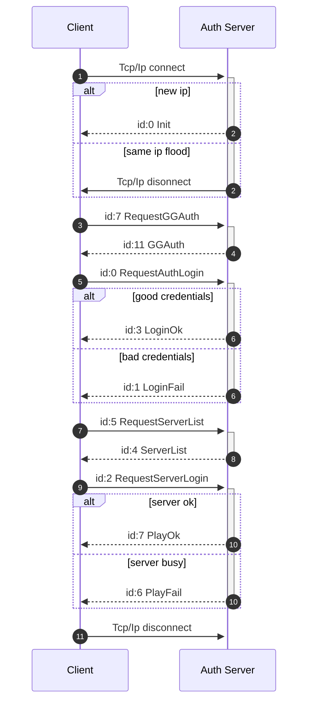

<!--
SPDX-FileCopyrightText: © 2024 Melg Eight <public.melg8@gmail.com>

SPDX-License-Identifier: MIT
-->

# Description of client-server protocol

Description client-server communication protocol based on [L2JLisvus](https://gitlab.com/TheDnR/l2j-lisvus/) server emulator.


# Authentification

Game servers have at least two differrent revisions of auth server protocol c621 and 785a. l2j-lisvus uses c621 which is described below.



Process of handling recieved packets:
1. Check recieved raw data length and compare it with expected packet length from data[2] field.
2. If raw data is smaller then expected length, read tcp/ip again and concatenate data
3. Check packet checksum
4. Decrypt packet if there is current decryption key is set, or use packet as is if no decription key is set.
5. Check packet type
6. If current state of authentification expecting packet of specific type, proceed deserialization of packet into data structure.
7. Use data structure in next state of authentification.

    

## Auth server -> client packets


### 0. Packets common structure
Packets have similar structure to eachother. They consist of:
   

| Hex | Size | Bytes | Enc | Description |
|-----|------|-------|-----|-------------|
|XX XX|2|[0-1]| |Size of packet|
|XX |1|[2]| 🔓 |Id of packet|
|XX XX XX XX .. |N|[3-(N+2)]| 🔓|Body of packet|
|00 .. |0-4|[(N+3)-(N+6)]| 🔓|Padding with zeroes for 8 byte alignment of packet|
|XX XX XX XX |4|[(N+7)-(N+10)]| 🔓| Checksum (only auth server communications) |


There are 6 different types of data that can be passed in packet

| Hex | Size | Type description |
|-----|------|-------------|
|XX XX XX .. \0|N|string UTF8|
|XX XX XX XX ..|8|float|
|XX XX XX XX ..|8|int 64|
|XX XX XX XX|4|int 32|
|XX XX|2|int 16|
|XX|1|int 8|


Auth server packets are encrypted using [Blowfish](https://en.wikipedia.org/wiki/Blowfish_(cipher)) algorithm with 21 bytes hardcoded key:
```
5F 3B 35 2E 5D 39 34 2D 33 31 3D 3D 2D 25 78 54 21 5E 5B 24 # Actual key
00 # End of key indicator
```


## Auth server -> client packets


### 1. [Init](https://gitlab.com/TheDnR/l2j-lisvus/-/blame/main/core/java/net/sf/l2j/loginserver/serverpackets/Init.java#L19)
----

| Hex | Size | Description | Bytes |
|-----|------|-------------|-------|
| 00 | 1 | [Type](https://gitlab.com/TheDnR/l2j-lisvus/-/blame/main/core/java/net/sf/l2j/loginserver/serverpackets/Init.java#L43) | [0] |
| XX XX XX XX |  4 | [Session ID](https://gitlab.com/TheDnR/l2j-lisvus/-/blame/main/core/java/net/sf/l2j/loginserver/serverpackets/Init.java#L44) | [1 - 4] |
| 21 C6 00 00| 4 | [Protocol revision](https://gitlab.com/TheDnR/l2j-lisvus/-/blame/main/core/java/net/sf/l2j/loginserver/serverpackets/Init.java#L45) | [5 - 8] |
| XX XX XX XX ... | 128| [RSA Public Key](https://gitlab.com/TheDnR/l2j-lisvus/-/blame/main/core/java/net/sf/l2j/loginserver/serverpackets/Init.java#L47)| [9 - 136] |
| 29 DD 95 4E | 4 | [GG related](https://gitlab.com/TheDnR/l2j-lisvus/-/blame/main/core/java/net/sf/l2j/loginserver/serverpackets/Init.java#L50) | [137 - 140] |     
| 77 C3 9C FC | 4 | [GG related](https://gitlab.com/TheDnR/l2j-lisvus/-/blame/main/core/java/net/sf/l2j/loginserver/serverpackets/Init.java#L51) | [141 - 144] |          
| 97 AD B6 20 | 4 | [GG related](https://gitlab.com/TheDnR/l2j-lisvus/-/blame/main/core/java/net/sf/l2j/loginserver/serverpackets/Init.java#L52) | [145 - 148] |     
| 07 BD E0 F7 | 4 | [GG related](https://gitlab.com/TheDnR/l2j-lisvus/-/blame/main/core/java/net/sf/l2j/loginserver/serverpackets/Init.java#L53) | [149 - 152] |
| XX XX XX XX ...| 20 | [Blowfish key (Only if compatibility mode enabled)](https://gitlab.com/TheDnR/l2j-lisvus/-/blame/main/core/java/net/sf/l2j/loginserver/serverpackets/Init.java#L57) | [153 - 172] |
| 00 | 1 | [End of key indicator (Only if compatibility mode enabled)](https://gitlab.com/TheDnR/l2j-lisvus/-/blame/main/core/java/net/sf/l2j/loginserver/serverpackets/Init.java#L58) | [173] |

Example of raw full Init packet, notice total length of packet is 159 bytes caused by 2 bytes with size of packet at beginning of packet and 4 bytes with padding at the end of packet. Server sends this packet unencrypted and without
checksum:
```diff
0000:|9f 00|00|b8 cd 6b 8b|21 c6 00 00|2e ac d4 98 2c  .....k.!.......,
0010: 71 bb 2f a7 6f 1d af 58 7c fd d3 c2 6d c4 f4 c4  q./.o..X|...m...
0020: 2b 9f 3b 09 42 c7 8c 72 e9 7d 03 bf 24 4b df d2  +.;.B..r.}..$K..
0030: 85 64 88 58 dc 8c f6 a6 ac 78 cc 75 5b ae 3d 7b  .d.X.....x.u[.={
0040: 18 ec 5e e1 d5 48 13 1c 00 63 d2 02 1f 35 f5 34  ..^..H...c...5.4
0050: 35 1d d6 90 8f 34 e3 3c d4 ed f9 83 55 b4 61 3b  5....4.<....U.a;
0060: 73 1d a2 4f 1b 3e 71 c3 af 0c 14 b8 1c 2f bf 64  s..O.>q....../.d
0070: 66 06 e5 77 4f 26 fe b8 da b3 2c c5 55 68 37 e5  f..wO&....,.Uh7.
0080: 9f 65 84 c3 93 71 0e 35 f3 15 59|4e 95 dd 29|fc  .e...q.5..YN..).
0090: 9c c3 77|20 b6 ad 97|f7 e0 bd 07|00 00 00 00     ..w ...........
Size: 159 bytes
```

Parsed Init packet:
```
InitPacket:
  SessionID: 8b6bcdb8
  ProtocolVersion: 0000c621
  RsaPublicKey:
    2eacd4982c71bb2fa76f1daf587cfdd3
    c26dc4f4c42b9f3b0942c78c72e97d03
    bf244bdfd285648858dc8cf6a6ac78cc
    755bae3d7b18ec5ee1d548131c0063d2
    021f35f534351dd6908f34e33cd4edf9
    8355b4613b731da24f1b3e71c3af0c14
    b81c2fbf646606e5774f26feb8dab32c
    c5556837e59f6584c393710e35f31559

  GameGuard1: 29dd954e
  GameGuard2: 77c39cfc
  GameGuard3: 97adb620
  GameGuard4: 07bde0f7
  BlowfishKey: nil
```


### 2. [GGAuth](https://gitlab.com/TheDnR/l2j-lisvus/-/blob/main/core/java/net/sf/l2j/loginserver/serverpackets/GGAuth.java#L24)

----

| Hex | Size | Description | Bytes |
|-----|------|-------------|-------|
| 0B | 1 | [Type](https://gitlab.com/TheDnR/l2j-lisvus/-/blob/main/core/java/net/sf/l2j/loginserver/serverpackets/GGAuth.java#L45) | [0] |
| XX XX XX XX |  4 | [Session ID](https://gitlab.com/TheDnR/l2j-lisvus/-/blob/main/core/java/net/sf/l2j/loginserver/clientpackets/RequestAuthGG.java#L81)| [1 - 4] |
| 00 00 00 00 |  4 | [Unknown](https://gitlab.com/TheDnR/l2j-lisvus/-/blob/main/core/java/net/sf/l2j/loginserver/serverpackets/GGAuth.java#L47)| [5 - 8] |


## Client -> auth server packets

### 1. [RequestGGAuth](https://gitlab.com/TheDnR/l2j-lisvus/-/blame/main/core/java/net/sf/l2j/loginserver/clientpackets/RequestAuthGG.java#L23)


| Hex | Size | Description | Bytes |
|-----|------|-------------|-------|
| 07 | 1 | [Type](https://gitlab.com/TheDnR/l2j-lisvus/-/blob/main/core/java/net/sf/l2j/loginserver/L2LoginPacketHandler.java#L55) | [0] |
| XX XX XX XX | 4 | [Session ID](https://gitlab.com/TheDnR/l2j-lisvus/-/blame/main/core/java/net/sf/l2j/loginserver/clientpackets/RequestAuthGG.java#L25) | [1 - 4] |
| 23 92 90 4D | 4 | [Data 1](https://gitlab.com/TheDnR/l2j-lisvus/-/blame/main/core/java/net/sf/l2j/loginserver/clientpackets/RequestAuthGG.java#L26) | [5 - 8] |
| 18 30 B5 7C | 4 | [Data 2](https://gitlab.com/TheDnR/l2j-lisvus/-/blame/main/core/java/net/sf/l2j/loginserver/clientpackets/RequestAuthGG.java#L27) | [9 - 12] |
| 96 61 41 47 | 4 | [Data 3](https://gitlab.com/TheDnR/l2j-lisvus/-/blame/main/core/java/net/sf/l2j/loginserver/clientpackets/RequestAuthGG.java#L28) | [13 - 16] |
| 05 07 96 FB | 4 | [Data 4](https://gitlab.com/TheDnR/l2j-lisvus/-/blame/main/core/java/net/sf/l2j/loginserver/clientpackets/RequestAuthGG.java#L29) | [17 - 20] |


### 2. [RequestAuthLogin](https://gitlab.com/TheDnR/l2j-lisvus/-/blob/main/core/java/net/sf/l2j/loginserver/clientpackets/RequestAuthLogin.java#L31)
| Hex | Size | Description | Bytes |
|-----|------|-------------|-------|
| 00 | 1 | [Type](https://gitlab.com/TheDnR/l2j-lisvus/-/blob/main/core/java/net/sf/l2j/loginserver/L2LoginPacketHandler.java#L65) | [0] |
| 00 00 00 00 ... | 89 | [Padding](https://gitlab.com/TheDnR/l2j-lisvus/-/blob/main/core/java/net/sf/l2j/loginserver/clientpackets/RequestAuthLogin.java#L45) | [1 - 90] |
| 24 | 1 | [Account Start Flag](https://gitlab.com/TheDnR/l2j-lisvus/-/blob/main/core/java/net/sf/l2j/loginserver/clientpackets/RequestAuthLogin.java#L52) | [91] |
| 00 00 | 2 | [Padding](https://gitlab.com/TheDnR/l2j-lisvus/-/blob/main/core/java/net/sf/l2j/loginserver/clientpackets/RequestAuthLogin.java#L52) | [92 - 93] |
| XX XX XX XX ... | 14 | [Account](https://gitlab.com/TheDnR/l2j-lisvus/-/blob/main/core/java/net/sf/l2j/loginserver/clientpackets/RequestAuthLogin.java#L82) | [94 - 107] |
| XX XX XX XX ... | 16 | [Password](https://gitlab.com/TheDnR/l2j-lisvus/-/blob/main/core/java/net/sf/l2j/loginserver/clientpackets/RequestAuthLogin.java#L83) | [108 - 124] |
| 00 00 | 2 | [Padding]() | [125 - 127] |


## Steps of packet assembly
- RegisterNewPacket(packetID int32, packetSize int32)
    - reserve 2 bytes for packet size
    - set packet id to proper value for each packet
- Write...(...)
    - insert packet data
- Assemble()
    - reserve 0-7 bytes for padding depending on current size to be 8 byte aligned
    - calculate size of packet and insert to first 2 bytes
    - claculate checksum from packet id to end of packet - 4 bytes
    - insert checksum to last 4 bytes
    - encrypt from 2 to end
- Packet()


